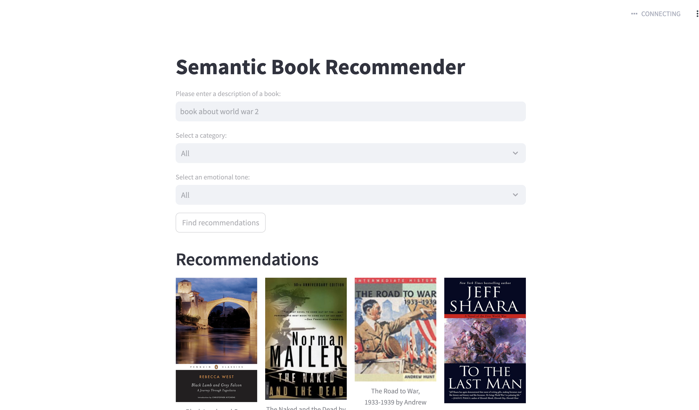

# 📚 BookWhisper

**BookWhisper** is an **LLM-powered book recommendation system** that helps users discover books through natural language queries. Whether you're looking for *a thrilling spy novel*, *a heartwarming story of friendship*, or *an inspiring nonfiction biography*, **BookWhisper** understands your query semantically and recommends books that match your intent and emotion.

The application supports:
- Intelligent semantic search over book descriptions
- Filtering recommendations by category (Fiction/Nonfiction/Children's Fiction/ Children's Non Fiction)
- Sorting by emotional tone (Joy, Surprise, Anger, Disgust, Neutral, Fear, Sadness)

All of this is wrapped in an easy-to-use **Streamlit** interface.

---

## 🧠 Key Features

- 🔍 **Semantic Search** with vector embeddings using `sentence-transformers/all-MiniLM-L6-v2`
- 🧾 **Zero-shot Text Classification** for Fiction vs Nonfiction using `facebook/bart-large-mnli`
- 😊 **Emotion Extraction** from book descriptions using `j-hartmann/emotion-english-distilroberta-base`
- 📊 **Filtering** by category and emotional tone
- 🌐 **Streamlit Web App** for an interactive recommendation experience

---

## 🧱 Project Structure

```
BookWhisper/
├── data-exploration.ipynb           # Cleaning and preprocessing the book data
├── vector-search.ipynb              # Vector database construction and semantic retrieval
├── text-classification.ipynb        # Zero-shot classification: Fiction vs Nonfiction
├── sentiment-analysis.ipynb         # Emotion extraction from book descriptions
├── streamlit-dashboard.py           # Streamlit app for querying and recommending books
├── books_cleaned.csv                # Cleaned book data
├── books_with_categories.csv        # Books with classified categories
├── books_with_emotions.csv          # Books with emotion scores
├── tagged_description.txt           # ISBN-tagged book descriptions
├── tagged_description.txt           # Source file used for generating vector embeddings
├── book_cover_not_found.jpg         # Fallback image for missing book thumbnails
└── README.md                        # Project documentation
```

---

## 🔧 How It Works

### 1. 🧼 Text Data Cleaning
- Loaded and cleaned book metadata and descriptions using `data-exploration.ipynb`
- Removed rows with missing values and filtered out short descriptions

### 2. 🧠 Vector Embeddings and Semantic Search
- Book descriptions were embedded using:
  ```python
  HuggingFaceEmbeddings(model_name="sentence-transformers/all-MiniLM-L6-v2")
  ```
- Stored and queried via:
  ```python
  from langchain_chroma import Chroma
  db_books = Chroma.from_documents(...)
  ```
- Enabled natural language querying, such as:  
  *“a book about World War One”* → semantically matched relevant book descriptions

### 3. 🏷️ Zero-shot Text Classification
- Used Hugging Face pipeline:
  ```python
  from transformers import pipeline
  pipe = pipeline("zero-shot-classification", model="facebook/bart-large-mnli", device="mps")
  ```
- Categories: `"Fiction"`, `"Nonfiction"`, `"Children's Fiction"`, `"Children's Non Fiction"`
- Labeled each book description accordingly

### 4. 🎭 Sentiment Analysis (Emotion Extraction)
- Extracted emotional tones using:
  ```python
  model: j-hartmann/emotion-english-distilroberta-base
  ```
- Emotions scored: `"joy"`, `"sadness"`, `"anger"`, `"fear"`, `"surprise"`, `"disgust"`, `"neutral"`

### 5. 🌐 Streamlit Application
- User inputs a **natural language query**
- Optionally filters by **category** (fiction/nonfiction) and **emotional tone**
- Uses `db_books.similarity_search(...)` to retrieve top matches
- Sorts and displays results accordingly

---

## 💻 Streamlit Dashboard Preview

### Working Demo


**UI Features**:
- Text input for custom book queries
- Dropdown filters for category and emotion
- Image + title + author + description preview
- Graceful fallback for missing book covers


## 🎥 Video Demo:

Watch the demo on YouTube: [https://youtu.be/Gec4onU-Zjc](https://youtu.be/Gec4onU-Zjc)


---

## 🔋 Models Used

| Task                     | Model                                                              |
|--------------------------|--------------------------------------------------------------------|
| Sentence Embeddings      | `sentence-transformers/all-MiniLM-L6-v2`                          |
| Text Classification      | `facebook/bart-large-mnli`                                        |
| Emotion Extraction       | `j-hartmann/emotion-english-distilroberta-base`                   |

---

## 🚀 Getting Started

### 1. Clone the repository
```bash
git clone https://github.com/gchkiran/book-whisper.git
cd book-whisper
```

### 2. Install dependencies
```bash
pip install -r requirements.txt
```

### 3. Run the app
```bash
streamlit run streamlit-dashboard.py
```

---


## 🙌 Acknowledgements

- Inspired by the [freeCodeCamp YouTube tutorial](https://www.youtube.com/watch?v=Q7mS1VHm3Yw)
- LLMs from [Hugging Face](https://huggingface.co/)
- Vector DB and Embeddings via [LangChain](https://www.langchain.com/)
- UI built with [Streamlit](https://streamlit.io)

---

## 📬 Feedback

Have suggestions or feature requests? Please open an [issue](https://github.com/gchkiran/book-whisper/issues) or reach out!
